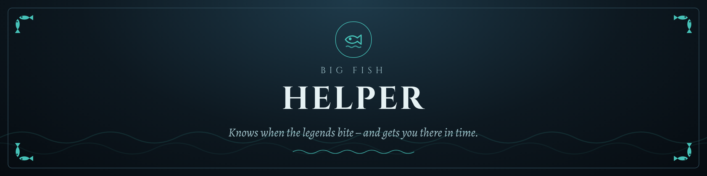
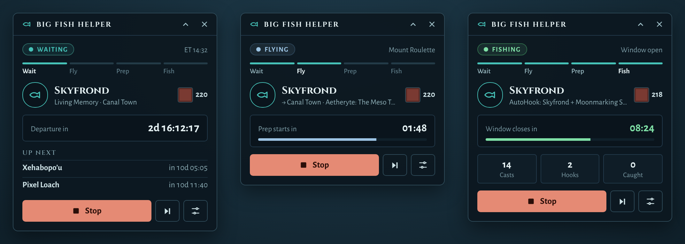

<p align="center">
  
</p>

<p align="center">
  <b>A Dalamud plugin for Final Fantasy XIV that tracks every Big Fish window – and takes you there in time to catch it.</b>
</p>

<p align="center">
  <a href="https://github.com/stoni89/big-fish-helper/releases"></a>
  <a href="https://github.com/stoni89/big-fish-helper/issues"></a>
  
  
</p>

<p align="center">
  <a href="#-features">Features</a> ·
  <a href="#-installation">Installation</a> ·
  <a href="#-getting-started">Getting started</a> ·
  <a href="#-required-plugins">Required plugins</a> ·
  <a href="#-feedback--bug-reports">Feedback</a>
</p>

---

## 🎣 What is Big Fish Helper?

Big Fish only bite in short windows, sometimes once every few days, often at 3 a.m. your time. Big Fish Helper keeps track of every window for you.

Plan the fish you want, and the plugin does the rest. It flies to the spot before the window opens, switches to Fisher and fishes with the right AutoHook preset. A small overlay always shows what's next and how long it is until then.

<p align="center">
  
</p>

---

## ✨ Features

- **Fish Data for every expansion:** all Big Fish from A Realm Reborn to Dawntrail, with the next window, its duration and rarity.
- **Live windows:** open windows are highlighted with a countdown until they close.
- **Bait at a glance:** the in-game bait icons with your current inventory stock. Missing bait is marked in red.
- **Prep timer:** set how many minutes before a window you want to be ready. The fish is added to your plan.
- **AutoHook presets per fish:** pick the preset once, and it is used automatically when the window opens.
- **Planned Fish:** your personal queue, sorted by the next window, with one click to start or stop.
- **Automation:** flies to the next fish before its prep time, switches to Fisher and fishes from the start of the prep time.
- **Status overlay:** Waiting, Flying, Preparing and Fishing, with a phase bar, countdown, a session catch counter and a compact mode.
- **Hide caught fish:** focus on what is still missing in your log.
- **Settings for the trip:** fisher preset, mount for flying, Sprint in cities, desynthesis after fishing and more.

---

## 📦 Installation

Big Fish Helper is distributed through a custom Dalamud repository.

1. In game, open the Dalamud settings with `/xlsettings` and go to **Experimental**.
2. Under **Custom Plugin Repositories**, paste this URL and click **+**:
   ```
   https://raw.githubusercontent.com/stoni89/DalamudPlugins/main/repo.json
   ```
3. Click **Save**, then open the plugin installer with `/xlplugins`.
4. Search for **Big Fish Helper** and click **Install**.

> [!IMPORTANT]
> Only add repositories you trust. Custom plugins are not reviewed by the Dalamud team.

---

## 🚀 Getting started

| Command | What it does |
|---|---|
| `/bigfish` | Opens/closes the Big Fish Helper menu. |

1. Open the menu and go to **Fish Data**. Pick an expansion.
2. Set a **prep timer** for the fish you want and choose an **AutoHook preset**.
3. Go to **Start**, check your **Planned Fish** and press **Start**.
4. The overlay keeps you posted, even while the plugin waits for a window days away.

---

## 🔌 Required plugins

| Plugin | Used for |
|---|---|
| vnavmesh | Flies the automation to each fish's fishing position. |
| AutoHook | Handles the actual fishing (hooking, bait, actions). |
| Lifestream | Teleports to the nearest aetheryte when the fish is in another zone. |

The **Plugins** page in the menu shows what is installed and what is missing.

---

## 💬 Feedback & bug reports

Found a bug, a wrong window or a missing fish? Have an idea for a feature? Please open an [issue](https://github.com/stoni89/big-fish-helper/issues).

For bug reports, the following helps a lot:
- your plugin version (shown on the **About** page, and next to the logo in the sidebar),
- the fish and the spot it is about,
- the relevant lines from the **Log** page.

---

<p align="center">
  <sub>FINAL FANTASY is a registered trademark of Square Enix Holdings Co., Ltd. This project is not affiliated with or endorsed by Square Enix.</sub>
</p>
